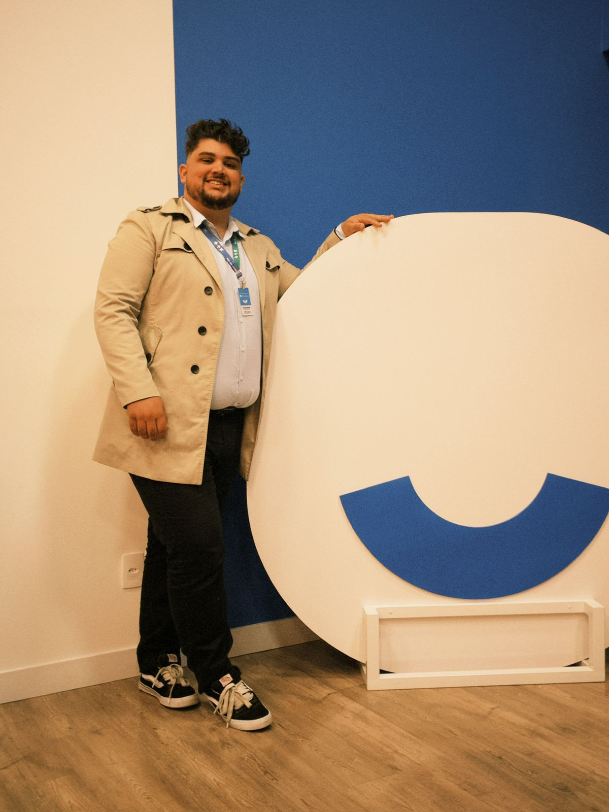

# 🚀 Meu Portfólio
https://v-cerqueira.github.io/Curriculo-Vinicius-Cerqueira-Silva/

<div align="center">
  
  
  ### **Vinicius Cerqueira Silva** | **Desenvolvedor com Viés em Dados**
  
  [](https://linkedin.com/in/viniciusplanejamento-bi-excel)
  [](https://github.com/v-cerqueira)
  [](mailto:vcerqueira@outlook.com.br)
</div>

---

## 📋 **O que é este projeto?**

Criei este portfólio para mostrar meu trabalho e minha jornada profissional. É um site com visual cyberpunk que combina minha experiência em dados com minha paixão por desenvolvimento web.

### **O que tem de especial:**
- 🎨 Visual cyberpunk elegante (gosto muito desse estilo)
- 🌐 Funciona em português, inglês e espanhol
- 📱 Se adapta perfeitamente a qualquer dispositivo
- ✨ Animações e efeitos visuais que deixam o site mais dinâmico
- 🚀 Performance otimizada para carregar rápido

---

## 🛠️ **Como foi feito**

### **Tecnologias que usei:**
- **HTML5** - Para estruturar o conteúdo
- **CSS3** - Para deixar bonito e responsivo
- **JavaScript** - Para as funcionalidades e troca de idiomas

### **Recursos especiais que implementei:**
- **CSS Grid & Flexbox** - Para o layout ficar perfeito em qualquer tela
- **Animações CSS** - Para os efeitos de hover e transições
- **Intersection Observer** - Para animações baseadas no scroll
- **Google Fonts** - Orbitron para títulos e Rajdhani para o texto

---

## 🎯 **Sobre mim**

### **Vinicius Cerqueira Silva**
**Onde moro:** Araucária/PR | **Disponível para mudar** | **Prefiro híbrido ou remoto**

### **Minha história:**
Trabalho há anos com análise de dados e automação de processos. Agora estou fazendo a transição para desenvolvimento de software, cursando Análise e Desenvolvimento de Sistemas na Unicesumar. Quero usar minha experiência com lógica e otimização para criar soluções de software que realmente funcionem.

### **O que sei fazer bem:**
- 📊 **Power BI** - Faço dashboards e automações (nível intermediário/avançado)
- 📈 **Excel Avançado** - Dashboards, fórmulas complexas, gráficos dinâmicos
- 🗄️ **SQL** - Consultas básicas em PostgreSQL e MySQL
- 🔄 **Power Query** - Linguagem M para transformar dados
- 📚 **Microsoft Access** - Para gerenciar bancos de dados

### **O que estou estudando:**
- 🐍 **Python** - Para análise de dados e automação
- 💻 **JavaScript** - Para desenvolvimento web
- 🔷 **TypeScript** - JavaScript com tipos para projetos mais robustos

---

## 💻 **Projetos em Desenvolvimento**

### **Beatfy - Angular** | [Ver no GitHub](https://github.com/fsluz/Beatfy)
Projeto desenvolvido em **Angular** com TypeScript, CSS e HTML. Aplicação web com foco em funcionalidades modernas e interface responsiva.

**Tecnologias:** Angular, TypeScript, CSS, HTML

### **Sistema Financeiro - Java** | [Ver no GitHub](https://github.com/fsluz/financeiro-java)
Sistema financeiro desenvolvido em **Java** com PostgreSQL, utilizando JFreeChart para gráficos e interface desktop robusta.

**Tecnologias:** Java, PostgreSQL, JFreeChart, Swing

### **TypeScript FTE** | [Ver no GitHub](https://github.com/fsluz/typescript-fte)
Projeto em **TypeScript** focado em desenvolvimento frontend com tipagem estática e boas práticas de programação.

**Tecnologias:** TypeScript, Frontend Development

### **Trabalho 2 - POO** | [Ver no GitHub](https://github.com/v-cerqueira/Trabalho2-POO)
Segundo trabalho de **Programação Orientada a Objetos**, demonstrando conceitos avançados de POO e estruturação de código.

**Tecnologias:** Java, POO, Conceitos Avançados

### **Trabalho 1 - POO** | [Ver no GitHub](https://github.com/v-cerqueira/Trabalho1-POO)
Primeiro trabalho de **Programação Orientada a Objetos**, introduzindo conceitos fundamentais de POO e desenvolvimento Java.

**Tecnologias:** Java, POO, Conceitos Fundamentais

---

## 💼 **Minha experiência profissional**

### **Atendente de Negócios** | Paraná Banco | Abr/2023-Atual
- Analiso elegibilidade e negocio crédito consignado usando KPIs
- **Automatizei relatórios no Power BI** - Transformei um processo manual de 10 minutos em Excel em uma análise visual automática
- **Aumentei a frequência de atualização** de 3 vezes ao dia para atualizações por hora

### **Supervisor de Operações Pleno** | DBM Contact Center | Set/2021-Out/2022
- Liderava equipe e monitorava via dashboards Excel/Power BI
- Automatizei processos para clientes como Eudora, Furukawa e Paraná Banco

### **Supervisor de Operações** | SoftMarketing | Set/2017-Mai/2020
- Gerenciava e melhorava KPIs operacionais (NS, TMA, IQA/SLA, IDSP)
- Treinava e liderava equipes multidisciplinares

---

## 🎓 **Formação e certificações**

- **Tecnólogo em Análise e Desenvolvimento de Sistemas** | Unicesumar | Termino em 2026
- **SQL para Análise de Dados** | Data Science Academy | 2024
- **Excel Avançado e Power BI** | Udemy | 2023

---

## 🚀 **Como usar este projeto**

### **O que você precisa:**
- Um navegador web (Chrome, Firefox, Safari, Edge)
- Servidor local (opcional, só se quiser desenvolver)

### **Como rodar:**
1. **Baixe os arquivos:**
   ```bash
   git clone https://github.com/v-cerqueira/portfolio-futuristico.git
   cd portfolio-futuristico
   ```

2. **Abra no navegador:**
   ```bash
   # Windows
   start index.html
   
   # macOS
   open index.html
   
   # Linux
   xdg-open index.html
   ```

3. **Ou simplesmente arraste o arquivo `index.html` para seu navegador**

---

## 📁 **Estrutura dos arquivos**

```
portfolio-futuristico/
├── index.html          # Estrutura e conteúdo principal
├── style.css           # Estilos e animações
├── script.js           # Funcionalidades JavaScript
├── perfil.jpg          # Minha foto
└── README.md           # Este arquivo
```

---

## 🎨 **Cores que escolhi**

- **Primária:** `#2E3138` - Cinza escuro, quase preto (sofisticado)
- **Secundária:** `#00BCD4` - Ciano vibrante (futurista)
- **Acento:** `#64FFDA` - Verde água brilhante (tecnológico)
- **Texto:** `#FFFFFF` - Branco (limpo e legível)
- **Background:** `#1A1A1D` - Gradiente com linhas em movimento

---

## ✨ **O que implementei**

### **Interface:**
- 🌟 Header com meu nome animado e trocador de idiomas
- 📸 Minha foto com efeitos de hover e bordas que giram
- 🎭 Seções organizadas para experiência, habilidades e formação
- 🔗 Links para minhas redes sociais com efeitos elegantes

### **Animações:**
- ✨ Partículas flutuantes no fundo
- 🎬 Efeito de digitação no título principal
- 🎭 Glitch ocasional no logo (gosto desse efeito)
- 🎯 Hover 3D nos cards
- 🌊 Linhas em movimento no background
- 💫 Transições suaves em tudo

### **Responsividade:**
- 📱 Design mobile-first
- 🖥️ Se adapta automaticamente a qualquer tela
- 🎯 Layout otimizado para diferentes dispositivos

---

## 🌐 **Funcionalidade multilíngue**

O site funciona em **3 idiomas**:

- 🇧🇷 **Português** (padrão)
- 🇺🇸 **Inglês**
- 🇪🇸 **Espanhol**

**Como usar:** Clique nos botões PT/EN/ES no header para trocar o idioma.

---

## 🔧 **Como personalizar**

### **Mudar cores:**
Edite as variáveis CSS no arquivo `style.css`:

```css
:root {
    --primary-color: #2E3138;
    --secondary-color: #00BCD4;
    --accent-color: #64FFDA;
    /* ... outras variáveis */
}
```

### **Adicionar novos idiomas:**
Edite o objeto `translations` no arquivo `script.js`:

```javascript
const translations = {
    pt: { /* português */ },
    en: { /* inglês */ },
    es: { /* espanhol */ },
    // Adicione novos idiomas aqui
};
```

---

## 📱 **Compatibilidade**

- ✅ **Chrome** 80+
- ✅ **Firefox** 75+
- ✅ **Safari** 13+
- ✅ **Edge** 80+
- ✅ **Navegadores mobile** (iOS Safari, Chrome Mobile)

---

## 🚀 **O que quero fazer depois**

- [ ] **Integração com backend** - API para formulário de contato
- [ ] **Seção de blog** - Artigos sobre tecnologia e dados
- [ ] **Galeria de projetos** - Mostrar outros trabalhos que desenvolvi
- [ ] **Temas alternativos** - Dark/light mode
- [ ] **Recursos PWA** - Poder instalar como app

---

## 📞 **Como me encontrar**

- **Email:** [vcerqueira@outlook.com.br](mailto:vcerqueira@outlook.com.br)
- **Telefone:** (41) 99581-1045
- **LinkedIn:** [viniciusplanejamento-bi-excel](https://linkedin.com/in/viniciusplanejamento-bi-excel)
- **GitHub:** [v-cerqueira](https://github.com/v-cerqueira)

---

## 📄 **Licença**

Este projeto está sob licença **MIT**. Pode usar, modificar e distribuir livremente.

---

## 🙏 **Agradecimentos**

- **Google Fonts** pelos tipos que usei
- **CSS Grid & Flexbox** pelo layout responsivo
- **Intersection Observer API** pelas animações baseadas em scroll
- **Comunidade de devs** por todo o conhecimento compartilhado

---

<div align="center">
  
  ### **⭐ Se gostou do projeto, deixa uma estrela! ⭐**
  
  **Feito com ❤️ e ☕ por Vinicius Cerqueira Silva**
  
  *"Transformando dados em soluções, criando o futuro com código"*
  
</div>

